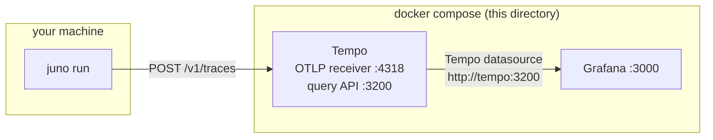
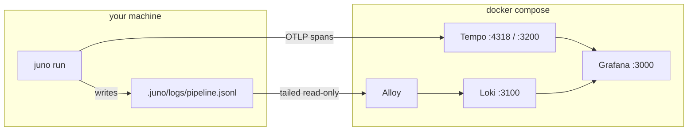

# Local traces for Juno

Juno emits OpenTelemetry traces. This directory runs a Tempo to receive them
and a Grafana to read them back, both on your machine.

## How it fits together



Juno runs on the host and posts batched spans to `http://localhost:4318`, which
Tempo publishes. Grafana sits beside Tempo on the compose network and queries it
by service name. Juno never talks to Grafana, and Grafana never stores anything;
Tempo is the store.

Every port is bound to `127.0.0.1`, so nothing here is reachable from outside
this machine.

## Running it

```bash
docker compose -f observability/compose.yml up -d
source observability/juno-otel.env
juno run --once
```

Then open <http://localhost:3000>. Authentication is turned off for this local
stack, so it drops you straight in as an admin.

To stop it, `docker compose -f observability/compose.yml down`. Traces survive
that in a named volume; add `-v` to delete them too.

## Finding a trace

Explore, pick the Tempo datasource, then the TraceQL tab. Juno writes its own
facts onto every span, so these work:

```
{ resource.service.name = "juno" }
{ span.juno.item.id = "DEMO-1" }
{ span.juno.step.id = "spec" && span.juno.cost_usd > 0.5 }
{ span.juno.score.passed = false }
{ span.gen_ai.request.model = "claude-opus-5" }
```

Set the time picker to cover the run. Tempo's search is time-ranged and returns
nothing outside it, which looks identical to having no data.

Search also lags ingest by a few seconds while Tempo makes the new spans
searchable. Fetching a trace by its id works immediately; finding it by a
TraceQL filter may need one retry right after a run finishes.

Opening a result gives the waterfall: `juno.item <id>` at the root, a
`juno.step` under it per step, a `juno.round` per round, and the generator and
evaluator calls under the round with their model, token counts and cost in the
attribute panel.

## What is on a span

Three vocabularies, all written at once, so nothing needs mapping:

- `gen_ai.*`, the OpenTelemetry GenAI conventions: model, input and output
  tokens, conversation id.
- `langfuse.*`, ignored by Tempo. Present so the same trace works against
  Langfuse without reconfiguring Juno.
- `juno.*`, Juno's own facts: `juno.item.id`, `juno.step.id`, `juno.round`,
  `juno.role`, `juno.cost_usd`, `juno.exit_code`, `juno.score.value`,
  `juno.tools.names`.

## Two settings worth knowing

`.juno/workflow.yaml` holds the only four telemetry keys. Everything else, the
endpoint and timeout above included, is a standard `OTEL_*` variable read by the
SDK.

```yaml
telemetry:
  enabled: true
  serviceName: juno
  detail: normal          # minimal | normal | verbose
  captureContent: true
```

`detail` decides how much of the tree is emitted. `minimal` is the pass, items
and steps. `normal` adds rounds, model calls, evaluators, scripts, hooks and
transitions. `verbose` adds a span for roughly 25 internal side effects such as
`state.commit` and `env.create`.

`captureContent` is on. That puts the full prompt Juno built, which includes
`.juno/context/business-context.md` and the work item body, plus the model's
response text onto each generation span. Useful here, since it means you can
read what the model was told without leaving the trace. It also makes spans
large, which is why `tempo.yaml` raises the per-trace byte ceiling. Turn it off
in `.juno/workflow.yaml` if you ever point Juno at a backend you do not own.

## Two stores, two questions



**Tempo answers "what happened in this run".** One trace per item, the full waterfall
of steps, rounds, model calls, hooks and transitions, with the prompt and response text
on each generation span.

**Loki answers "how much, how many, per what".** Totals across runs: spend to date,
items completed, cost per item, cost per step. Tempo cannot answer these, for two
reasons measured on this stack and written up below: TraceQL metrics return nothing for
any span-attribute aggregate, and TraceQL search returns spans from one block per trace,
so even summing search results understates. The event log has the same numbers exactly,
and Loki makes a file of JSON lines aggregatable.

They are not redundant. The dashboard's tiles come from Loki; its trace table comes from
Tempo, and every row links into the waterfall.

## The dashboard

Provisioned at boot from `grafana/dashboards/juno.json`, at
<http://localhost:3000/d/juno-traces>.

A row of stat tiles across the top: total spend, items completed, cost per item, model
calls, rubric retries. Then magnitude breakdowns by item, step and role; spend over
time; the raw model-call and score lines; and the trace table.

Every tile was checked against the event log and matches it:

| Tile | Dashboard | `pipeline.jsonl` |
| --- | --- | --- |
| Total spend | $10.0857 | $10.0857 |
| Items completed | 2 | 2 |
| Model calls | 16 | 16 |
| Rubric retries | 2 | 2 |
| Spend by item | 4.60 / 5.48 | 4.60 / 5.48 |
| Spend by step | 4.65 / 3.91 / 1.53 | 4.65 / 3.91 / 1.53 |

Colour follows the job rather than taste. The breakdowns compare magnitude, so they use
one hue and darker simply means more. The over-time chart separates items, which is
identity, so it uses two hues from a fixed order, validated for colour-blind separation
and contrast in both light and dark themes.

`allowUiUpdates` is on, so edits you make in the browser stick until the file changes.
To keep an edit, copy the dashboard's JSON Model back over
`grafana/dashboards/juno.json`.

## Restarting after a config change

`docker compose up -d` leaves a running container alone when only another service's
definition changed, and a bind-mounted config file updates without the process rereading
it. This has bitten twice here, once on a Tempo setting and once on a Grafana
datasource. Force it and then verify:

```bash
docker compose -f observability/compose.yml up -d --force-recreate tempo
curl -s localhost:3200/status/config | grep trace_idle_period
curl -s localhost:3000/api/datasources | python3 -m json.tool
```

## Charts, and what does not work yet

`tempo.yaml` enables the metrics generator with the `local-blocks` processor.
That is what makes TraceQL metrics queries possible, the ones that return a time
series rather than a list of traces, and it is the only piece here that is not
retroactive: it processes spans as they arrive, so it has to be on before the
runs you want to chart. No Prometheus is involved, `remote_write` is empty and
Tempo answers these queries itself.

One metrics query returns values:

```
{ resource.service.name = "juno" } | rate()
```

Everything filtering or grouping by a span attribute comes back as an empty series with
HTTP 200 and no error. That covers `sum_over_time(span.juno.cost_usd)` in every form
tried, `count_over_time()` with a span filter, and `rate() by (span.juno.step.id)`.
Tested against both synthetic spans and a real run, so it is not an artefact of the test
data. The dividing line appears to be resource attributes against span attributes,
though the cause has not been established. There is no cost chart as a result.

Tempo also rejects a metrics query wider than **3 hours**, which is why the activity
panel pins its own 2h window with `timeFrom` instead of following the time picker.

### Search returns one block per trace, and why trace_idle_period is set

TraceQL search returns matching spans from a single block per trace. Two real runs were
both split: BOOK-1 reported 5 of its 8 model calls ($3.65 of $4.60), BOOK-2 reported 3 of
8 ($2.82 of $5.48). Fetching either trace by id returned all 8 and the exact total, so
nothing was lost in storage.

The cause is `trace_idle_period`, whose default is 5 seconds. Tempo cuts a trace into a
block once no new span has arrived for that long. A Juno model call runs for minutes with
no span ending, so at 5s one run is chopped into several blocks and search then reads
only one of them. `max_block_duration` is not the lever; it was tried first and made no
difference.

Measured on this stack with a 60s idle window and two spans sharing a trace id:

| Gap between spans | Stored trace | TraceQL search |
| --- | --- | --- |
| 30s, inside the window | 2 spans, $3.00 | 2 spans, $3.00 |
| 95s, outside the window | 2 spans, $3.00 | 1 span, $1.00 |

`trace_idle_period` is now `15m`, wider than the longest gap seen in a run. The cost is
that a trace is not searchable until 15 minutes after its last span. Fetching it by id
still works immediately.

Changing this needs a real restart. `docker compose up -d` leaves a running Tempo alone
when only another service's definition changed, and the bind-mounted file updates without
Tempo rereading it. Use `docker compose -f observability/compose.yml up -d
--force-recreate tempo` and confirm with `curl -s localhost:3200/status/config`.

Cost per run is exact in the event log instead, described below.

## The event log is a separate thing

`.juno/logs/pipeline.jsonl` is written on every run whatever the telemetry
setting says, and none of it travels over OTLP. `juno logs` and `juno status`
read that file. Getting it into Grafana would need Loki and a log shipper, which
this stack does not include.

Cost per run is the one number that is easier there than here:

```bash
jq -r 'select(.event=="runner.finished")
       | [.itemId, .stepId, .round, .role, .costUsd] | @tsv' .juno/logs/pipeline.jsonl
```
